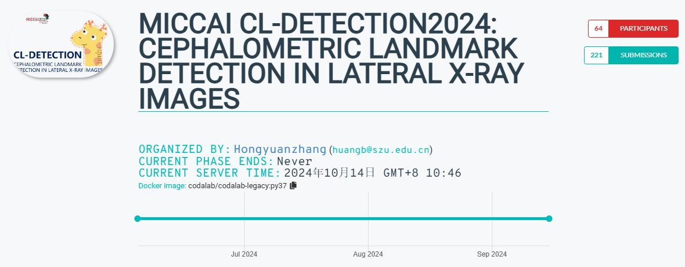
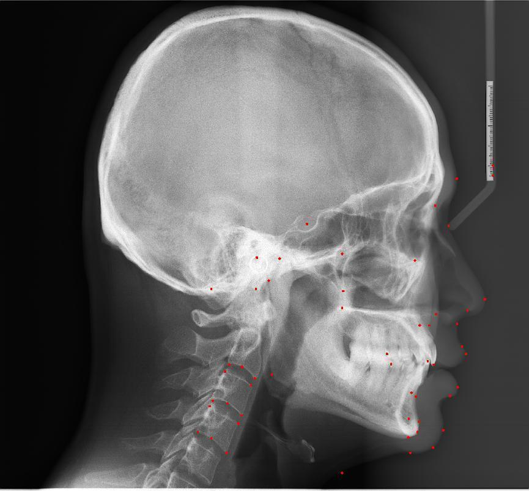
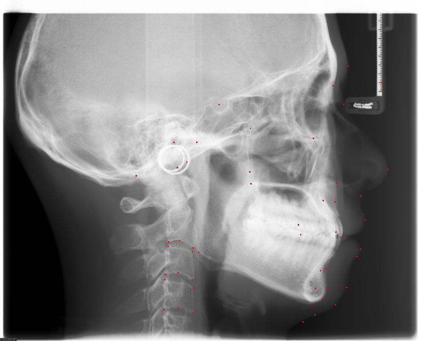
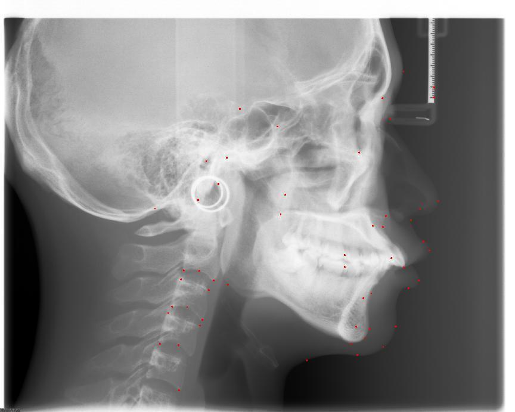
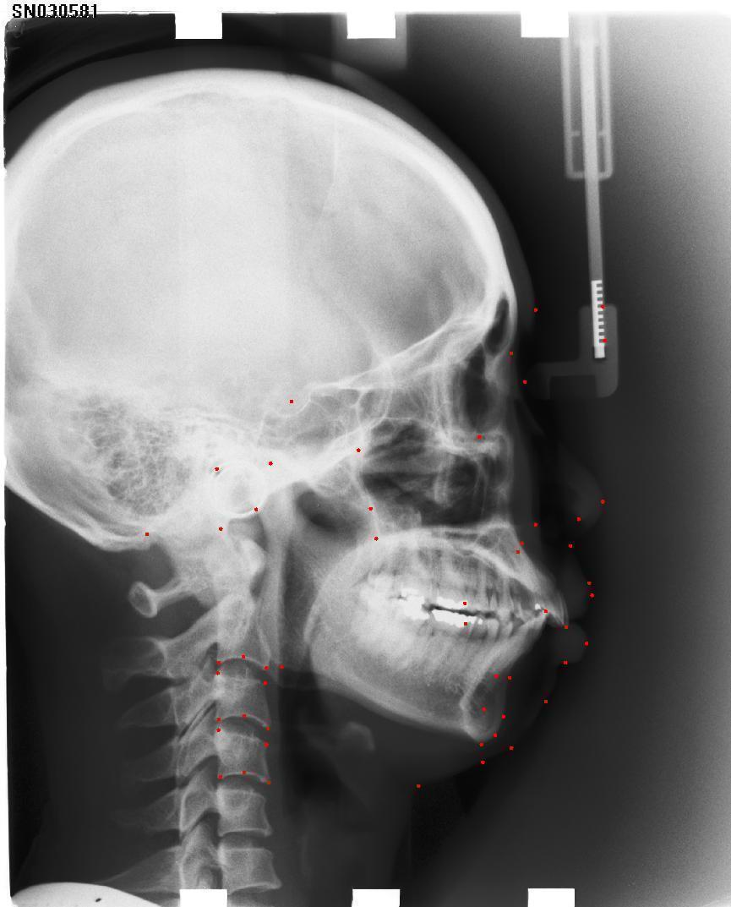

# MICCAI CL-Detection2024: Cephalometric Landmark Detection in Lateral X-ray Images
> This is an example of the x-ray image is used to cephalometric landmark detection.

## Prerequisities
The following dependencies are needed:
- arrow==1.2.3
- binaryornot==0.4.4
- build==0.10.0
- certifi==2022.12.7
- chardet==5.1.0
- charset-normalizer==3.1.0
- click==8.1.3
- cookiecutter==2.1.1
- idna==3.4
- imageio[tifffile]==2.27.0
- jinja2==3.1.2
- jinja2-time==0.2.0
- joblib==1.2.0
- markupsafe==2.1.2
- numpy==1.21.6
- packaging==23.1
- pandas==1.3.5
- pillow==9.5.0
- pip-tools==6.13.0
- pyproject-hooks==1.0.0
- python-dateutil==2.8.2
- python-slugify==8.0.1
- pytz==2023.3
- pyyaml==6.0
- requests==2.28.2
- scikit-learn==1.0.2
- scipy==1.7.3
- simpleitk==2.2.1
- six==1.16.0
- text-unidecode==1.3
- threadpoolctl==3.1.0
- tifffile==2021.11.2
- tomli==2.0.1
- tzdata==2023.3
- urllib3==1.26.15
- wheel==0.40.0
- scikit-image==0.19.3
- evalutils==0.3.1
- opencv-python==4.7.0.68
- matplotlib==3.5.3
- torchsummary==1.5.1
- tensorboard==2.11.2
- onnx==1.13.0
- openslide-python==1.2.0
- pyvips==2.2.3
- seaborn>=0.11.0
- tqdm>=4.64.0
- PyYAML>=5.3.1
- setuptools>=65.5.1 # Snyk vulnerability fix
- thop>=0.1.1  # FLOPs computation
- torchinfo==1.8.0

## How to Use
* 1、download the whole project,install Python Environment using requirements.txt.
* 2、run Cl-Detection2024 folder process.py for x-ray cephalometric landmark detection inference:make sure input_path and output_file has effective path.

## Result

#  x-ray cephalometric landmark detection predict result

* you can find the x-ray inference code in Cl-Detection2024 folder.
* more detail and trained model can follow my WeChat Public article.

## Contact
* https://github.com/junqiangchen
* email: 1207173174@qq.com
* Contact: junqiangChen
* WeChat Number: 1207173174
* WeChat Public number: 最新医学影像技术
